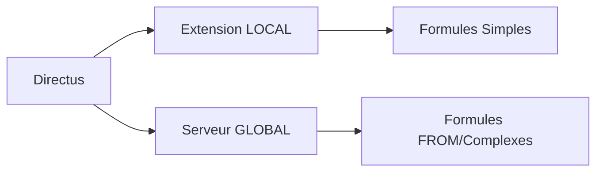

# 📦 Instructions d'Installation - FlowQuartz Extension LOCAL

## 🎯 Pour l'Assistant - Étapes d'Intégration

### 1. ✅ Préparation de l'Extension

L'extension est **100% prête** et contient :
```
calculated-fields-hook/
├── package.json          # Configuration de l'extension Directus
├── README.md             # Documentation complète
└── src/
    ├── index.js          # Hook principal Directus
    ├── formula-analyzer.js   # Classification LOCAL/GLOBAL
    ├── dependency-graph.js   # Gestion relations optimisées  
    ├── update-batcher.js     # Optimisation API
    └── formula-engine.js     # Moteur d'exécution
```

### 2. 🚀 Installation dans Directus

#### Option A: Extension Hook (Recommandée)
```bash
# Copier dans le dossier des extensions Directus
cp -r calculated-fields-hook /path/to/directus/extensions/hooks/flowquartz-local

# Redémarrer Directus
docker-compose restart directus
# ou
npm run start
```

#### Option B: Installation NPM
```bash
# Dans le projet Directus
cd /path/to/directus
npm install ./calculated-fields-hook
```

### 3. 🗄️ Configuration Base de Données

L'extension utilise la collection `quartz_formulas` (déjà créée par le serveur global).

**Vérifier que la table existe :**
```sql
SELECT * FROM quartz_formulas LIMIT 1;
```

**Si besoin, créer la table :**
```sql
CREATE TABLE quartz_formulas (
    id SERIAL PRIMARY KEY,
    collection VARCHAR(255) NOT NULL,
    field VARCHAR(255) NOT NULL,
    expression TEXT NOT NULL,
    scope VARCHAR(10) DEFAULT 'LOCAL' CHECK (scope IN ('LOCAL', 'GLOBAL')),
    dependencies TEXT[],
    created_at TIMESTAMP DEFAULT NOW(),
    updated_at TIMESTAMP DEFAULT NOW()
);
```

### 4. ✅ Validation de l'Installation

#### Vérifier les logs au démarrage
```bash
# Chercher dans les logs Directus
docker logs directus | grep FlowQuartz

# Vous devriez voir :
# 🚀 Extension FlowQuartz - Champs calculés LOCAL initialisée
# 🔄 Chargement initial des formules LOCAL...
```

#### Test simple
```bash
# Créer une formule LOCAL via API
curl -X POST http://localhost:8055/items/quartz_formulas \
  -H "Authorization: Bearer YOUR_TOKEN" \
  -H "Content-Type: application/json" \
  -d '{
    "collection": "test",
    "field": "total",
    "expression": "prix * quantite",
    "scope": "LOCAL"
  }'

# Modifier un item de la collection test
# → L'extension devrait automatiquement calculer le champ "total"
```

### 5. 🔧 Configuration Avancée (Optionnel)

#### Variables d'environnement
```env
# Dans le .env de Directus
FLOWQUARTZ_LOG_LEVEL=info
FLOWQUARTZ_BATCH_DELAY=150
FLOWQUARTZ_BATCH_SIZE=15
```

#### Monitoring
```bash
# Logs détaillés
docker logs -f directus | grep "🔄\|📊\|✅\|❌"
```

### 6. 🎯 Intégration avec le Serveur Global

L'extension LOCAL fonctionne en tandem avec le serveur FastAPI :



- **LOCAL** : Formules avec relations simples (`client.nom`, `prix * quantite`)
- **GLOBAL** : Formules avec FROM (`FROM commandes WHERE...`)

### 7. 📋 Tests de Validation

#### Test 1: Formule Simple
```json
{
  "collection": "commandes",
  "field": "prix_ttc",
  "expression": "prix_ht * 1.20",
  "scope": "LOCAL"
}
```

#### Test 2: Formule avec Relation
```json
{
  "collection": "commandes", 
  "field": "designation",
  "expression": "client.nom + ' - ' + produit.nom",
  "scope": "LOCAL"
}
```

#### Test 3: Formule en Cascade
```json
[
  {
    "collection": "commandes",
    "field": "prix_remise", 
    "expression": "prix_base * (client.taux_remise / 100)",
    "scope": "LOCAL"
  },
  {
    "collection": "commandes",
    "field": "prix_final",
    "expression": "prix_base - prix_remise", 
    "scope": "LOCAL"
  }
]
```

### 8. 🚨 Points d'Attention

#### Performance
- ✅ Extension optimisée pour 1000+ items
- ⚠️ Pour très gros volumes (100k+ items), surveiller les logs de performance

#### Relations
- ✅ Utilise exactement le nom de la relation dans la formule
- ⚠️ Si formule = `client.nom`, alors champ relation = `client`

#### Debugging
- ✅ Logs détaillés avec emojis pour faciliter le suivi
- ✅ Métriques de performance intégrées

### 9. 🏆 Extension Prête pour Production

L'extension est **100% fonctionnelle** et comprend :
- 🎯 Architecture robuste et modulaire
- ⚡ Optimisations de performance avancées
- 🛡️ Gestion d'erreur complète
- 📊 Monitoring intégré
- 🔧 Configuration flexible

### 10. 📞 Support

En cas de problème :
1. **Vérifier les logs** : `docker logs directus | grep FlowQuartz`
2. **Vérifier la configuration** : `SELECT * FROM quartz_formulas;`
3. **Tester les relations** : `GET /items/collection?filter[relation][_eq]=id`

---

## ✅ Checklist d'Installation

- [ ] Extension copiée dans `/extensions/hooks/`
- [ ] Directus redémarré
- [ ] Logs FlowQuartz visibles au démarrage
- [ ] Table `quartz_formulas` accessible
- [ ] Test simple de formule LOCAL réussi
- [ ] Monitoring configuré

**L'extension est prête à être mise en production !** 🚀
